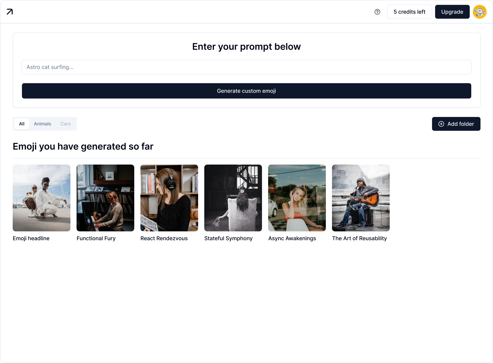

# 🎨 Emoji Maker

Generate custom emojis using AI-powered text-to-image generation with Replicate's SDXL Emoji model.



## ✨ Features

- 🤖 **AI-Powered Generation**: Create custom emojis from text prompts using Replicate's SDXL Emoji model
- 💾 **Persistent Storage**: All generated emojis are saved locally using localStorage
- ❤️ **Like System**: Mark your favorite emojis
- 📥 **Download**: Download any emoji as a PNG file
- 🏷️ **Filtering**: Organize emojis by categories (All, Animals, Cars)
- 🎭 **Beautiful UI**: Clean, minimalist design with smooth animations
- 📱 **Responsive**: Works seamlessly on desktop and mobile devices

## 🚀 Getting Started

### Prerequisites

- Node.js 18+ installed
- A Replicate API account and token

### Installation

1. Clone the repository:
```bash
cd emoji-maker
```

2. Install dependencies:
```bash
npm install
```

3. Set up your environment variables:
```bash
cp .env.example .env.local
```

4. Add your Replicate API token to `.env.local`:
```env
REPLICATE_API_TOKEN=r8_your_actual_token_here
```

Get your API token from [Replicate Account Settings](https://replicate.com/account/api-tokens)

5. Run the development server:
```bash
npm run dev
```

6. Open [http://localhost:3000](http://localhost:3000) in your browser

## 🎯 Usage

1. **Generate an Emoji**:
   - Enter a text prompt describing the emoji you want (e.g., "Astro cat surfing")
   - Click "Generate custom emoji"
   - Wait for the AI to create your emoji

2. **Interact with Emojis**:
   - Hover over any emoji to reveal action buttons
   - Click the download icon to save the emoji
   - Click the heart icon to like/unlike

3. **Filter Emojis**:
   - Use the tabs (All, Animals, Cars) to filter your generated emojis
   - Click "Add folder" to create custom categories (coming soon)

## 🛠️ Tech Stack

- **Framework**: [Next.js 15](https://nextjs.org/) with App Router
- **Language**: TypeScript
- **Styling**: Tailwind CSS 4
- **UI Components**: [shadcn/ui](https://ui.shadcn.com/)
- **Icons**: [Lucide React](https://lucide.dev/)
- **AI Model**: [Replicate SDXL Emoji](https://replicate.com/fofr/sdxl-emoji)

## 📁 Project Structure

```
emoji-maker/
├── app/
│   ├── api/
│   │   └── generate/
│   │       └── route.ts          # API route for emoji generation
│   ├── favicon.ico
│   ├── globals.css               # Global styles and animations
│   ├── layout.tsx                # Root layout
│   └── page.tsx                  # Main page with state management
├── components/
│   ├── ui/                       # shadcn/ui components
│   ├── emoji-card.tsx            # Individual emoji card with hover effects
│   ├── emoji-grid.tsx            # Grid layout for emojis
│   ├── filter-tabs.tsx           # Category filter tabs
│   ├── header.tsx                # Top navigation header
│   ├── loading-skeleton.tsx     # Loading animation
│   └── prompt-input.tsx          # Prompt input form
├── lib/
│   └── utils.ts                  # Utility functions
├── .env.example                  # Environment variables template
└── package.json
```

## 🎨 Components

### Header
Displays credits, help button, upgrade option, and user avatar.

### PromptInput
Form component for entering text prompts to generate emojis.

### FilterTabs
Category filtering system with "All", "Animals", "Cars" tabs and folder management.

### EmojiGrid
Responsive grid layout displaying all generated emojis.

### EmojiCard
Individual emoji display with hover effects revealing download and like buttons.

## 🔑 Environment Variables

| Variable | Description | Required |
|----------|-------------|----------|
| `REPLICATE_API_TOKEN` | Your Replicate API token | Yes |

## 📝 API Routes

### POST `/api/generate`

Generates a new emoji from a text prompt.

**Request Body:**
```json
{
  "prompt": "Astro cat surfing"
}
```

**Response:**
```json
{
  "success": true,
  "imageUrl": "https://replicate.delivery/.../output.png",
  "prompt": "Astro cat surfing"
}
```

## 🎭 Features in Detail

### Local Storage
All generated emojis are automatically saved to your browser's localStorage, so they persist across sessions.

### Credits System
Track your usage with a credit system. Each generation costs 1 credit. (Note: This is a UI demo - implement actual credit tracking with a backend)

### Download Functionality
Click the download button on any emoji to save it as a PNG file to your device.

### Like System
Mark your favorite emojis with the heart button. Liked emojis are saved locally.

## 🚧 Future Enhancements

- [ ] User authentication with Clerk
- [ ] Database integration with Supabase
- [ ] Custom folder creation
- [ ] Emoji sharing functionality
- [ ] Emoji editing and variants
- [ ] Export multiple emojis at once
- [ ] Search functionality
- [ ] Advanced filtering options

## 📄 License

This project is open source and available under the MIT License.

## 🙏 Acknowledgments

- [Replicate](https://replicate.com/) for the SDXL Emoji model
- [shadcn/ui](https://ui.shadcn.com/) for the beautiful UI components
- [Next.js](https://nextjs.org/) team for the amazing framework
