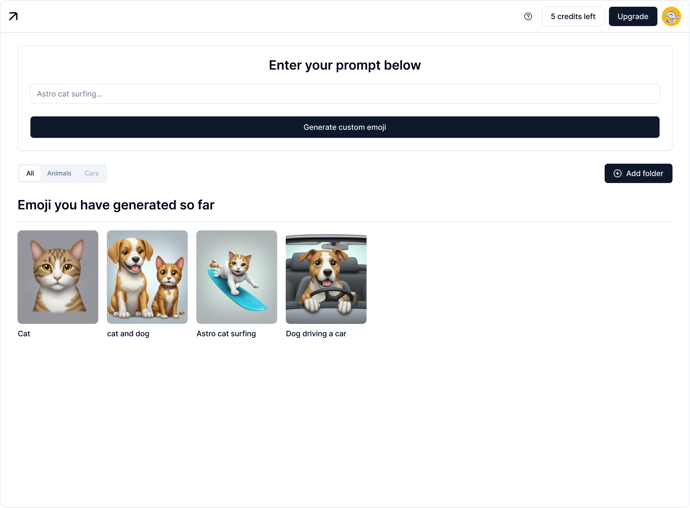

# 🎨 Emoji Maker - AI-Powered Emoji SaaS

Generate custom emojis using AI-powered text-to-image generation with Replicate's SDXL Emoji model. A complete SaaS platform with credit-based monetization, Stripe payment integration, and user authentication.



## ✨ Features

### Core Features
- 🤖 **AI-Powered Generation**: Create custom emojis from text prompts using Replicate's SDXL Emoji model
- 💾 **Cloud Storage**: All generated emojis stored in Supabase with metadata
- ❤️ **Like System**: Mark and track your favorite emojis
- 📥 **Download with Metadata**: Download emojis as PNG files with embedded metadata (prompt, author, copyright)
- 📁 **Folder Organization**: Create and manage custom folders to organize your emojis
- 🎭 **Beautiful UI**: Clean, minimalist design with smooth animations built with shadcn/ui
- 📱 **Responsive**: Works seamlessly on desktop and mobile devices

### SaaS Features
- 💳 **Stripe Payment Integration**: One-time purchases and subscriptions
- 🎟️ **Credit System**: Trial credits (5 free) + paid tiers
- 👤 **User Authentication**: Secure authentication with Clerk
- 📊 **Credit Tracking**: Detailed purchase history and credit allocations
- 🔄 **Subscription Management**: Monthly renewals with Stripe Customer Portal
- 🔒 **Secure Webhooks**: Validated Stripe webhook handling

## 💰 Pricing Tiers

### Free Trial
- **5 credits** (one-time, non-renewing)
- PNG export with metadata
- Personal and commercial use

### Starter Pack - $4.99
- **30 credits**
- PNG export with metadata
- Share to public gallery (coming soon)
- Priority email support

### Pro Pack - $9.99
- **75 credits**
- PNG export with metadata
- Batch generation (coming soon)
- Public gallery with analytics (coming soon)
- Custom style/prompt library (coming soon)
- Priority support

### Pro Monthly - $3.99/month
- **15 credits per month**
- PNG export with metadata
- Share to public gallery (coming soon)
- Auto-renews monthly
- Priority support

## 🚀 Getting Started

### Prerequisites

- Node.js 18+ installed
- A [Replicate](https://replicate.com) API account and token
- A [Supabase](https://supabase.com) project
- A [Clerk](https://clerk.com) application for authentication
- A [Stripe](https://stripe.com) account for payment processing

### Installation

1. **Clone the repository:**
```bash
cd emoji-maker
```

2. **Install dependencies:**
```bash
npm install
```

3. **Set up environment variables:**
```bash
cp .env.example .env.local
```

Edit `.env.local` and add your API keys:

```env
# Replicate
REPLICATE_API_TOKEN=r8_your_token_here

# Supabase
NEXT_PUBLIC_SUPABASE_URL=your_supabase_url
NEXT_PUBLIC_SUPABASE_ANON_KEY=your_supabase_anon_key

# Clerk
NEXT_PUBLIC_CLERK_PUBLISHABLE_KEY=your_clerk_publishable_key
CLERK_SECRET_KEY=your_clerk_secret_key

# Stripe
STRIPE_SECRET_KEY=sk_test_your_stripe_secret_key
NEXT_PUBLIC_STRIPE_PUBLISHABLE_KEY=pk_test_your_stripe_publishable_key
STRIPE_WEBHOOK_SECRET=whsec_your_webhook_secret

# Stripe Price IDs (create in Stripe Dashboard)
STRIPE_STARTER_PACK_PRICE_ID=price_xxxxx
STRIPE_PRO_PACK_PRICE_ID=price_xxxxx
STRIPE_PRO_MONTHLY_PRICE_ID=price_xxxxx

# App URL
NEXT_PUBLIC_APP_URL=http://localhost:3000
```

4. **Set up Supabase database:**
   - Open your Supabase project SQL Editor
   - Run the migration file: `supabase_saas_migration.sql`
   - This creates all necessary tables and indexes

5. **Set up Stripe:**
   - Follow the complete guide in [STRIPE_SETUP.md](./STRIPE_SETUP.md)
   - Create products and get Price IDs
   - Set up webhook forwarding

6. **Run the development server:**
```bash
npm run dev
```

7. **In another terminal, forward Stripe webhooks:**
```bash
stripe listen --forward-to localhost:3000/api/stripe/webhook
```

8. **Open your browser:**
   - Navigate to [http://localhost:3000](http://localhost:3000)
   - Sign up with Clerk
   - Start generating emojis!

## 🎯 Usage

### For Users

1. **Sign Up**:
   - Create an account using Clerk authentication
   - Get 5 free trial credits automatically

2. **Generate Emojis**:
   - Enter a text prompt (e.g., "Astro cat surfing")
   - Click "Generate custom emoji"
   - Each generation costs 1 credit

3. **Organize Your Emojis**:
   - Create folders to organize your emojis
   - Assign emojis to folders
   - Filter by folder in the tabs

4. **Download Emojis**:
   - Click the download button on any emoji
   - PNG includes embedded metadata (prompt, author, copyright)

5. **Upgrade for More Credits**:
   - Click the "Upgrade" button
   - Choose a pricing tier
   - Complete payment with Stripe
   - Credits are added automatically

6. **Manage Subscription** (Pro Monthly users):
   - Access Stripe Customer Portal from settings
   - Update payment method or cancel subscription

### Credit System

- **Trial**: 5 free credits (one-time)
- **Credits deduct**: 1 credit per emoji generation
- **No expiration**: Credits never expire (except monthly subscription)
- **Purchase history**: View all credit allocations in your account

## 🛠️ Tech Stack

### Frontend
- **Framework**: [Next.js 15](https://nextjs.org/) with App Router
- **Language**: TypeScript
- **Styling**: Tailwind CSS 4
- **UI Components**: [shadcn/ui](https://ui.shadcn.com/)
- **Icons**: [Lucide React](https://lucide.dev/)

### Backend & Services
- **AI Model**: [Replicate SDXL Emoji](https://replicate.com/fofr/sdxl-emoji)
- **Database**: [Supabase](https://supabase.com) (PostgreSQL)
- **Authentication**: [Clerk](https://clerk.com)
- **Payments**: [Stripe](https://stripe.com)
- **Image Processing**: [Sharp](https://sharp.pixelplumbing.com/)
- **Storage**: Supabase Storage

## 📁 Project Structure

```
emoji-maker/
├── app/
│   ├── api/                      # API routes
│   │   ├── emojis/              # Emoji CRUD operations
│   │   ├── folders/             # Folder management
│   │   ├── generate/            # AI emoji generation
│   │   ├── likes/               # Like system
│   │   ├── profile/             # User profile & credits
│   │   └── stripe/              # Payment processing
│   ├── dashboard/               # Main dashboard page
│   ├── sign-in/                 # Clerk sign-in page
│   ├── sign-up/                 # Clerk sign-up page
│   ├── globals.css              # Global styles and animations
│   ├── layout.tsx               # Root layout with ClerkProvider
│   └── page.tsx                 # Landing page
├── components/
│   ├── landing/                 # Landing page components
│   │   ├── hero.tsx            # Hero section
│   │   ├── features.tsx        # Features showcase
│   │   ├── gallery.tsx         # Example gallery
│   │   ├── pricing.tsx         # Pricing tiers
│   │   ├── testimonials.tsx    # User testimonials
│   │   └── faq.tsx             # FAQ section
│   ├── ui/                      # shadcn/ui components
│   ├── emoji-card.tsx           # Individual emoji card with hover effects
│   ├── emoji-grid.tsx           # Grid layout for emojis
│   ├── filter-tabs.tsx          # Folder tabs and filtering
│   ├── folder-modal.tsx         # Folder assignment modal
│   ├── header.tsx               # Dashboard header with credits
│   ├── loading-skeleton.tsx     # Loading animation
│   ├── prompt-input.tsx         # Prompt input form
│   ├── support-widget.tsx       # User support widget
│   └── upgrade-modal.tsx        # Stripe pricing modal
├── lib/
│   ├── credits.ts               # Credit system logic
│   ├── ensure-profile.ts        # Auto profile creation
│   ├── pricing.ts               # Pricing tier config
│   ├── profile-sync.ts          # Profile sync utilities
│   ├── stripe.ts                # Stripe client
│   ├── supabase.ts              # Supabase client
│   └── utils.ts                 # Utility functions
├── types/
│   ├── emoji.ts                 # Emoji type definitions
│   └── payment.ts               # Payment type definitions
├── archived/                     # Historical docs and files
├── middleware.ts                 # Clerk auth middleware
├── .env.example                  # Environment variables template
├── ARCHITECTURE.md               # Technical architecture docs
├── STRIPE_SETUP.md               # Stripe setup guide
├── supabase_saas_migration.sql   # Main database migration
├── supabase_folders_schema.sql   # Folders feature migration
└── package.json
```

## 🎨 Components

### Header
Displays credits, help button, upgrade option, and user avatar with Clerk authentication.

### PromptInput
Form component for entering text prompts to generate emojis. Shows credit cost and validates input.

### FilterTabs
Folder navigation system with "All" tab and custom user folders. Includes folder creation, renaming, and deletion.

### EmojiGrid
Responsive grid layout displaying all generated emojis with loading states and empty states.

### EmojiCard
Individual emoji display with hover effects revealing download, like, and folder assignment buttons.

### UpgradeModal
Pricing modal displaying all three tiers (Starter Pack, Pro Pack, Pro Monthly) with Stripe Checkout integration.

### SupportWidget
User support and help widget for easy access to documentation and assistance.

## 🔑 Environment Variables

| Variable | Description | Required |
|----------|-------------|----------|
| `REPLICATE_API_TOKEN` | Replicate API token for AI generation | Yes |
| `NEXT_PUBLIC_SUPABASE_URL` | Supabase project URL | Yes |
| `NEXT_PUBLIC_SUPABASE_ANON_KEY` | Supabase anonymous key | Yes |
| `NEXT_PUBLIC_CLERK_PUBLISHABLE_KEY` | Clerk publishable key | Yes |
| `CLERK_SECRET_KEY` | Clerk secret key | Yes |
| `STRIPE_SECRET_KEY` | Stripe secret key | Yes |
| `NEXT_PUBLIC_STRIPE_PUBLISHABLE_KEY` | Stripe publishable key | Yes |
| `STRIPE_WEBHOOK_SECRET` | Stripe webhook signing secret | Yes |
| `STRIPE_STARTER_PACK_PRICE_ID` | Stripe Price ID for Starter Pack | Yes |
| `STRIPE_PRO_PACK_PRICE_ID` | Stripe Price ID for Pro Pack | Yes |
| `STRIPE_PRO_MONTHLY_PRICE_ID` | Stripe Price ID for Pro Monthly | Yes |
| `NEXT_PUBLIC_APP_URL` | Your app URL (for redirects) | Yes |

See `.env.example` for a complete template.

## 📝 API Routes

### POST `/api/generate`

Generates a new emoji from a text prompt.

**Request Body:**
```json
{
  "prompt": "Astro cat surfing"
}
```

**Response:**
```json
{
  "success": true,
  "imageUrl": "https://replicate.delivery/.../output.png",
  "prompt": "Astro cat surfing"
}
```

## 🎭 Features in Detail

### Local Storage
All generated emojis are automatically saved to your browser's localStorage, so they persist across sessions.

### Credits System
Track your usage with a credit system. Each generation costs 1 credit. (Note: This is a UI demo - implement actual credit tracking with a backend)

### Download Functionality
Click the download button on any emoji to save it as a PNG file to your device.

### Like System
Mark your favorite emojis with the heart button. Liked emojis are saved locally.

## 📊 Database Schema

The application uses the following main tables:

- **profiles**: User accounts with credit balance and subscription status
- **user_credits**: Granular credit allocations with purchase tracking
- **emojis**: Generated emoji metadata and storage URLs
- **stripe_transactions**: Payment transaction records
- **folders**: User-created folders for organization
- **emoji_folders**: Junction table for emoji-folder assignments
- **emoji_likes**: User likes on emojis

See `supabase_saas_migration.sql` for the complete schema.

## 🚧 Future Enhancements

- [x] User authentication with Clerk
- [x] Database integration with Supabase
- [x] Custom folder creation
- [x] Stripe payment integration
- [x] Credit system with purchase history
- [x] PNG metadata embedding
- [ ] Public gallery for sharing emojis
- [ ] Batch generation (3-5 variations per prompt)
- [ ] Custom style/prompt saved library
- [ ] Emoji editing and variants
- [ ] Advanced analytics dashboard
- [ ] Search functionality
- [ ] Export multiple emojis at once

## 🧪 Testing

### Test Payment Flow

Use Stripe test cards:
- **Success**: `4242 4242 4242 4242`
- **Requires Auth**: `4000 0025 0000 3155`
- **Declined**: `4000 0000 0000 0002`

See [STRIPE_SETUP.md](./STRIPE_SETUP.md) for complete testing guide.

### Database Testing

After migration, verify:
1. New users get 5 trial credits
2. Credits deduct properly on generation
3. Payments add credits correctly
4. Subscription renewals work

## 🚀 Deployment

### Before Production

1. ✅ Run database migration in Supabase
2. ✅ Switch Stripe to live mode
3. ✅ Create live Stripe products and prices
4. ✅ Set up production webhook endpoint
5. ✅ Update all environment variables
6. ✅ Test payment flow end-to-end
7. ✅ Set up Replicate budget alerts ($5/day limit)

### Recommended Platforms

- **Frontend**: Vercel, Netlify
- **Database**: Supabase (already hosted)
- **Monitoring**: Sentry, LogRocket

## 📝 Important Notes

### Budget Management
- **Replicate Cost**: ~$0.0075 per emoji generation
- **Daily Budget**: $5/day = ~667 generations
- **Trial Cost**: $0.0375 per user (5 credits)
- **Max Trial Users/Day**: ~130 users

### Security
- Always verify Stripe webhook signatures
- Never expose secret keys in frontend
- Use HTTPS in production
- Enable Stripe Radar for fraud prevention

## 📄 License

This project is open source and available under the MIT License.

## 🙏 Acknowledgments

- [Replicate](https://replicate.com/) for the SDXL Emoji model
- [Stripe](https://stripe.com/) for payment infrastructure
- [Clerk](https://clerk.com/) for authentication
- [Supabase](https://supabase.com/) for database and storage
- [shadcn/ui](https://ui.shadcn.com/) for beautiful UI components
- [Next.js](https://nextjs.org/) team for the amazing framework

## 📞 Support

- Check [STRIPE_SETUP.md](./STRIPE_SETUP.md) for payment setup
- Review [ARCHITECTURE.md](./ARCHITECTURE.md) for technical specifications
- See [archived/requirements/](./archived/requirements/) for original development requirements
- Open an issue for bugs or feature requests
